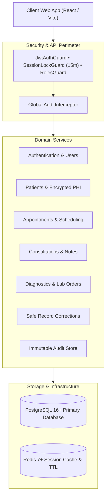

# CareSync — Healthcare Coordination Platform

CareSync is an enterprise-grade multi-specialty healthcare coordination system designed to unify clinical encounters, diagnostics, and patient management into a secure, HIPAA-aligned platform.

## Architecture Overview

CareSync employs a **Modular Monolith** architecture built with **NestJS**, **PostgreSQL**, and **Redis**, strictly adhering to Domain-Driven Design (DDD) principles and Clean Architecture.

## Core Security & Compliance Highlights

- **AES-256-GCM PHI Encryption**: Field-level encryption for all sensitive patient data at rest (`iv:auth_tag:ciphertext`).
- **15-Minute Workstation Auto-Lock**: Redis sliding-window session tracking; locks inactive terminals after 900s of inactivity (`HTTP 423 Locked`).
- **Append-Only Clinical Corrections**: Prevents destructive updates to finalized medical notes, preserving full audit history.
- **HIPAA Audit Logging**: Tamper-proof recording of sensitive data queries, record creations, and unauthorized access attempts.
- **Role-Based Access Control (RBAC)**: Strict principle of least privilege across Receptionist, Physician, Lab User, and Administrator roles.

## Tech Stack

- **Runtime**: Node.js v24+, TypeScript
- **Framework**: NestJS 11
- **Database**: PostgreSQL 16 with TypeORM
- **Cache & Session Store**: Redis 7
- **Password Hashing**: Argon2id
- **Containerization**: Docker Compose
